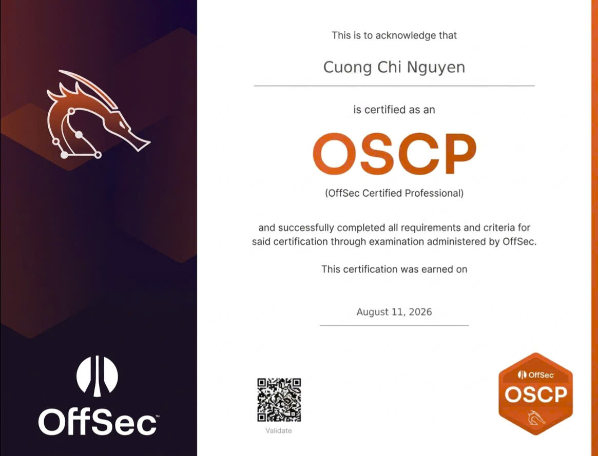
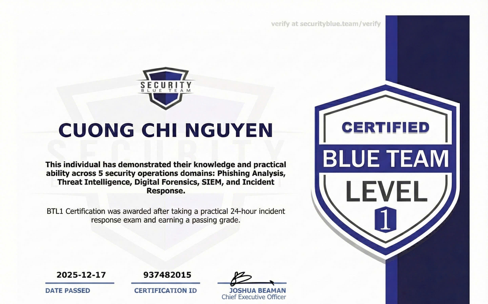
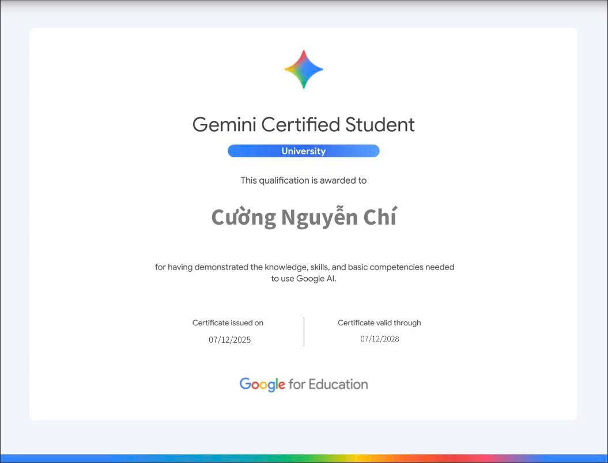

<h1 align="center">Cuong Chi Nguyen</h1>

  

### Professional Summary

I am **Cuong Chi Nguyen**, an undergraduate majoring in **Information Security** at **Ho Chi Minh City University of Industry and Trade (HUIT)**.

With a rare combination of offensive and defensive skill sets, I hold the distinguished **OffSec Certified Professional (OSCP)** certification, demonstrating rigorous practical mastery in penetration testing, vulnerability analysis, and real-world exploitation. I complement this with the **Blue Team Level 1 (BTL1)** certification, reinforcing my capabilities in security operations, threat detection, and incident response.

This dual perspective enables me to approach cybersecurity challenges holistically, understanding both the attacker's mindset and defensive countermeasures. I specialize in integrating AI with automated threat hunting, deploying scalable security infrastructure using AWS and Docker, and maintaining the security posture of critical assets. I am currently seeking professional roles in Security Operations (SOC) or Penetration Testing where I can leverage this unique combination to drive proactive defense strategies.

* **Location:** Ho Chi Minh City, Vietnam
* **Education:** Ho Chi Minh City University of Industry and Trade (HUIT)
* **Objective:** To excel as a leading Security Engineer, driving holistic security postures.

### Certifications

#### Featured Certification: OffSec Certified Professional (OSCP)

| Certification | Credential Verification |
| :--- | :--- |
|  | **Official OffSec Certified Professional Credential.**    Authenticity and current standing can be independently verified through the official OffSec validation portal or by scanning the provided QR code. |

---

#### Additional Certifications

| Blue Team Level 1 (BTL1) | Gemini Certified Student |
| :---: | :---: |
|  |  |
| *Practical competence in Phishing Analysis, Digital Forensics, SIEM (Splunk/Wazuh), and Incident Response.* | *Validated knowledge and competence in leveraging modern AI for research and process automation.* |

### Core Security & Development Projects

*Practical applications focusing on AI-driven security, automated scanning, and advanced analytics.*

| Project Title | Description & Objectives | Source Code |
| :--- | :--- | :---: |
| **Sentinel Security AI** | An intelligent threat intelligence platform that leverages machine learning to enhance automated incident response and proactive threat hunting by analyzing diverse data sources for advanced persistent threats (APTs). | [Repository](https://github.com/Nguyenchicuong34/Sentinel-Security-AI) |
| **Sentinel Security Scanner** | A high-performance network and application vulnerability scanner engineered for compliance auditing and reconnaissance. Designed to automatically discover and assess critical risks in hybrid (on-prem/cloud) environments. | [Repository](https://github.com/Nguyenchicuong34/Sentinel-Security-Scanner) |
| **Python AI Study** | Applied research into foundational machine learning and deep learning algorithms, including implementations for anomaly detection and predictive modeling relevant to security applications. | [Repository](https://github.com/Nguyenchicuong34/Python-AI-Study) |

### Technical Proficiencies

* **Operating Systems:** Kali Linux, Ubuntu Server, CentOS, Windows Server.
* **Cloud & Virtualization:** AWS (Amazon Web Services), Docker, VMware Workstation.
* **Security Operations (Blue Team):** Splunk, Wazuh (SIEM), Snort, Wireshark, Incident Response.
* **Penetration Testing (Red Team):** Nmap, Burp Suite, Metasploit, PowerShell, SQL Injection, Privilege Escalation.
* **Programming & Automation:** Python, Bash Scripting, C/C++, SQL.

### Connect with Me

* **Email:** [chicuong9802@gmail.com](mailto:chicuong9802@gmail.com)
* **Discord:** t4kad__51932
* **GitHub:** [Nguyenchicuong34](https://github.com/Nguyenchicuong34)
